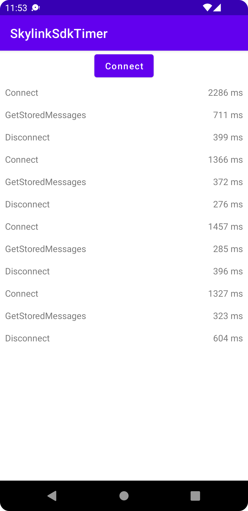

# Skylink SDK Timer

This repository contains an Android Studio project of a simple app that measures time to connect to a Skylink room, disconnect and get stored messages from the server.

Before building and running app, please set your Skylink Key ID and secret in `app/src/main/res/values/skylink_config.xml`.

```xml
<?xml version="1.0" encoding="utf-8"?>
<resources>
    <string name="app_key">Your Skylink Key ID should come here</string>
    <string name="app_key_secret">Your Skylink Key secret should come here</string>
</resources>
```

A screenshot of running app.

